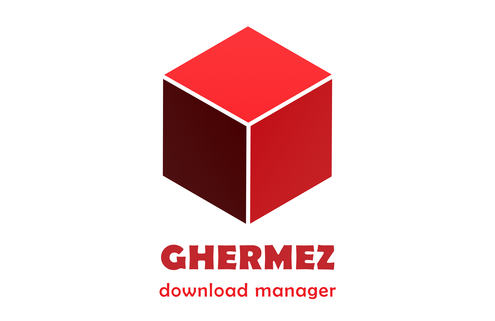

<!-- markdownlint-disable MD033 -->
<!-- markdownlint-disable MD041 -->

  

<h1 align="center">Ghermez Download Manager</h1>

  A Fast and Safe Download Manager build with ❤️
   
   
  <a href="https://github.com/IamRezaMousavi/ghermez"><strong>Explore the docs »</strong></a>
   
   
  <a href="https://github.com/IamRezaMousavi/ghermez/releases">View Release</a>
  .
  <a href="https://github.com/IamRezaMousavi/ghermez/issues">Report Bug</a>
  .
  <a href="https://github.com/IamRezaMousavi/ghermez/issues">Request Feature</a>

      

## Table Of Contents

- [About the Project](#about-the-project)
- [Contributing](#contributing)
- [Acknowledgements](#acknowledgements)

## About The Project

|GNU/Linux|Mac OSX|Windows|  
|:---:|:---:|:---:|
||||

Ghermez is a download manager & a GUI for [Aria2](https://github.com/aria2/aria2). It's written in `Python` and `Rust`. Ghermez is a sample of free and open source software. It's developed for GNU/Linux distributions, BSDs, MacOS, and Microsoft Windows.

### **Features**

- Multi-segment downloading
- Scheduling downloads
- Download queuing
- and many more!

## Contributing

Information describing how to contribute can be found in the file [CONTRIBUTING.md](./CONTRIBUTING.md)

## Acknowledgements

- [persepolis](https://github.com/persepolisdm/persepolis)
- [aria2-ws-rs](https://github.com/ComfyFluffy/aria2-ws-rs)
- [maturin](https://github.com/PyO3/maturin)

---
_Is there any bug? Report it in [issue tracker](https://github.com/IamRezaMousavi/ghermez/issues) or correct it by yourself._
